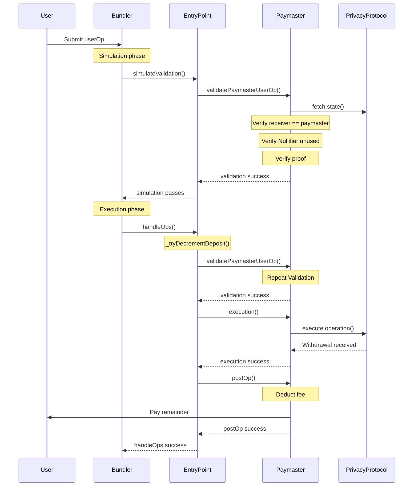

# privacy-paymaster

EIP-4337 compliant paymasters for sponsoring withdrawals from privacy protocols and seeding new private accounts.

These paymasters here are structurally similar to [ERC20 paymasters](https://docs.erc4337.io/paymasters/types.html#erc-20-paymaster-token-paymaster). They rely on being able to guarantee availability of payment during the `validatePaymasterUserOp` call and deduct the cost of the user operation from the withdrawed amount.

## Architecture

### Smart Contracts (Foundry/Solidity)
- **Location**: `/src/` directory
- **Key Contracts**:
  - `PrivacyPaymaster.sol` - Master paymaster controller. Routes user operations to protocol-specific account handlers and manages fee collection.
  - `accounts/IPrivacyAccount.sol` - 4337 sender account interface.
  - `accounts/BasePrivacyAccount.sol` - Base 4337 & privacy account impl. Executes user operations once validated.
  - `accounts/*Account.sol` - Protocol specific account implementations (e.g. TornadoAccount, RailgunAccount). Handle validation of userOps to ensure they corespond to valid unshields.

### Happy Path



## Development Commands

### Smart Contracts
```bash
# Compile contracts
forge build

# Run tests
forge test
```

## Coding Standards

### Solidity

- Follow existing contract patterns and naming conventions
- Use OpenZeppelin libraries where possible
- Maintain security best practices
- Document complex functions with NatSpec

### Documentation
- Write clear, beginner-friendly explanations
- Use examples with realistic numbers
- Follow established file structure

## Testing Strategy

- Unit tests for individual contract functions
- Integration tests for cross-contract interactions

## Support Commands

When working with this codebase, prefer these approaches:

### File Operations
- Use `Read` tool for examining contracts
- Use `Glob` tool for finding files by pattern
- Use `Grep` tool for searching code content

### Development
- Run `forge build` and `forge test` to verify contract changes
- Check git status before committing changes

## Common Patterns

### Contract Deployment
- Use deterministic deployment addresses where possible
- Maintain deployment scripts in `/script/`
- Document all deployment parameters
- Test on local forks and testnets before mainnet deployment

### Documentation Updates
1. Update relevant `.md` files in `/docs/`
2. Commit changes with descriptive messages
3. Build and deploy documentation site

## Security Considerations

- All contracts handle user funds - security is paramount
- Use established patterns from OpenZeppelin
- Implement proper access controls
- Consider economic attack vectors (oracle manipulation, front-running, etc.)
- Test edge cases thoroughly
- `validatePaymasterUserOp` must always guarantee that the paymaster will receive payment for the user operation.
- Paymasters should be designed to handle edge cases (e.g. failed withdrawals, small withdrawal amounts, front-running attempts, etc.) gracefully without risking loss of funds or denial of service.
- All sensitive data must be contained within the zk proofs to avoid replay attacks. For example, data from the paymasterData or calldata that is not validated by the proof should never be used.
