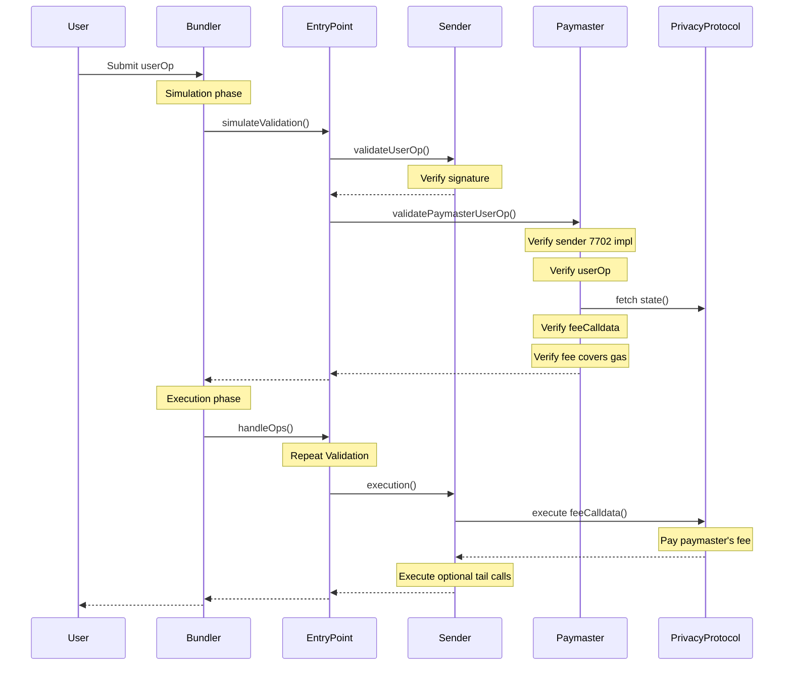

## Architecture

The paymaster validates the user's ZK proof and nullifier during `validatePaymasterUserOp`. If validation passes, the paymaster is committed to paying gas. During execution, the sender executes the fee-paying operation and any subsequent user-defined tail calls.

https://mermaid.live/edit

