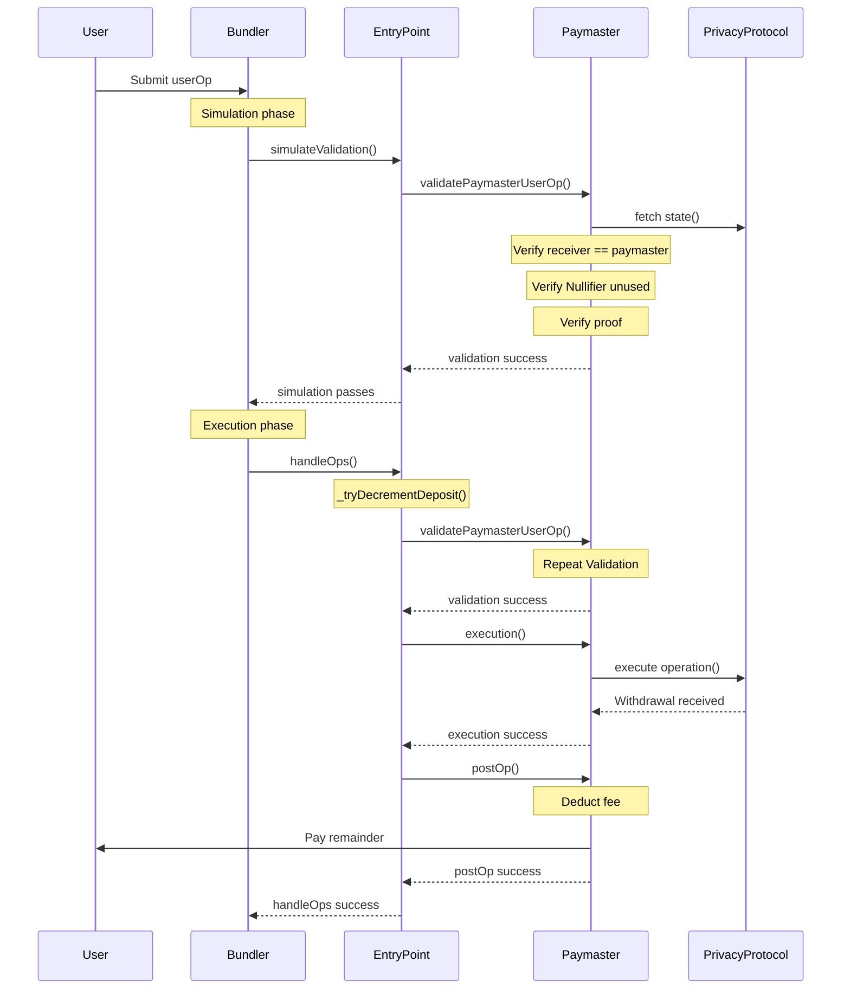
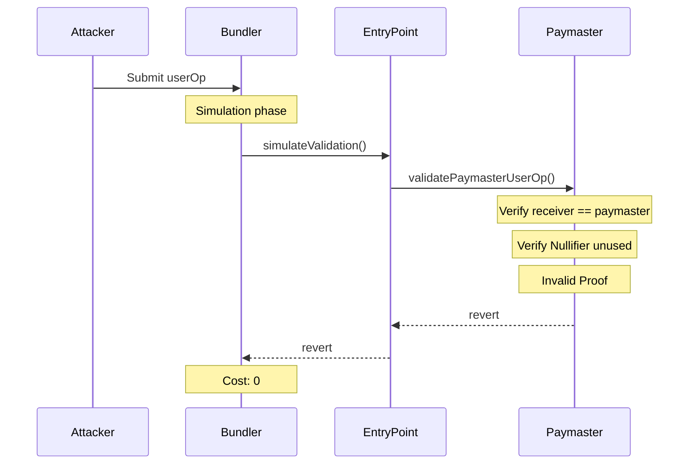
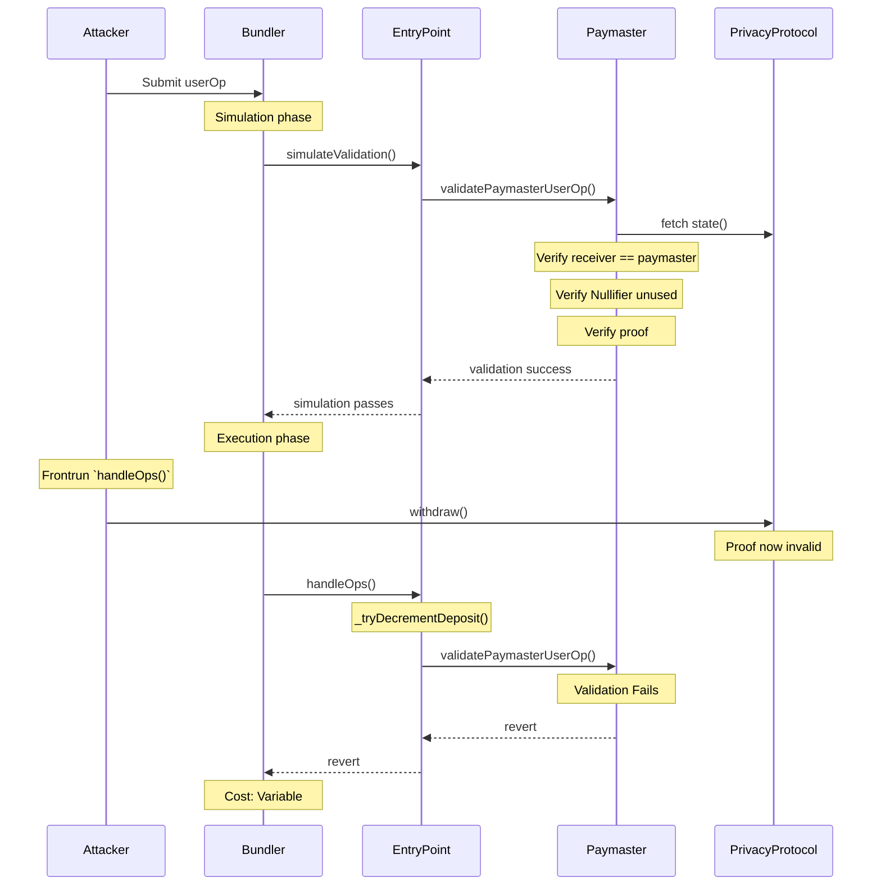

## Architecture

The paymaster validates the user's ZK proof and nullifier during `validatePaymasterUserOp`. If validation passes, the paymaster is committed to paying gas. During execution, the paymaster withdraws the note, deducts a fee, and forwards the remainder to the user's destination. The key insight is that proof validation is strictly cheaper than note creation, making griefing economically unprofitable.

### Happy Path

### Invalid Proof

### Nullifier Frontrun (Griefing the Bundler)

Only viable if the bundler's transaction can be frontran.

